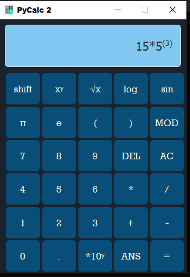

# PyQt6 Calculator

This is a simple calculator application implemented using PyQt6. The calculator provides a user-friendly interface for performing basic mathematical operations.

## Features

- Supports addition, subtraction, multiplication, and division.
- Provides functions for calculating square root, cube root, logarithm, and trigonometric functions (sine).
- Allows input of constants like pi and the Euler number (e).
- Provides error handling for invalid mathematical expressions.
- Stylish and intuitive user interface.

## Requirements

- Python 3.6 or higher
- PyQt6 library
- qdarkstyle library

## Installation

1. Clone the repository:

    ```bash
    git clone https://github.com/NiruddeshJatra/PyQt6-Tutorials.git
    ```

2. Navigate to the `Py Calculator` directory:

    ```bash
    cd PyQt6-Tutorials/Py Calculator
    ```

3. Install the required dependencies:

    ```bash
    pip install PyQt6 qdarkstyle
    ```

## Usage

Run the `PyCalc.py` script to launch the calculator application:

```bash
PyCalc.py
```


## Screenshots



## Acknowledgments

- This calculator application is based on the PyQt6 tutorials by [Niruddesh Jatra](https://github.com/NiruddeshJatra).
- Special thanks to the contributors and maintainers of PyQt6 and qdarkstyle libraries.

## License

This project is licensed under the MIT License - see the [LICENSE](LICENSE) file for details.

## Authors

- Nasiful ALam

## Contributions

Contributions are welcome! Feel free to submit bug reports, feature requests, or pull requests to improve this calculator application.
